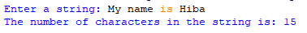

## Description
This is a simple program that prompts the user to enter a string. It then counts the number of characters in the input string and displays the result without using functions.
## Example

